# Amazon Financial Intelligence Platform

An interactive financial analytics and forecasting platform built using Python, SQL, Streamlit, and Power BI to analyze Amazon’s financial performance from 2020–2024.

The platform combines KPI monitoring, predictive analytics, anomaly detection, executive business insights, and interactive dashboarding into a modular and deployable analytics system.

---

# Features

* Interactive Streamlit dashboard
* Revenue and profitability KPI tracking
* Executive business insight generation
* Revenue forecasting using Linear Regression
* Interactive Plotly visualizations
* Dynamic year-based filtering
* Operating margin analysis
* Cloud revenue contribution analysis
* Modular analytics architecture
* Anomaly detection engine
* SQL-driven financial preprocessing
* Power BI reporting integration

---

# Dashboard Capabilities

## KPI Monitoring

Track:

* Total Revenue
* Net Income
* Operating Income
* Operating Margin
* Year-over-Year Growth

## Predictive Analytics

Forecast future revenue trends using machine learning models and visualize future business performance interactively.

## Executive Insights

Automatically generated business insights summarizing:

* Revenue trends
* Cloud business growth
* Profitability changes
* Operational performance

## Interactive Filtering

Users can dynamically filter dashboard visualizations by year using Streamlit sidebar controls.

---

# Tech Stack

| Category         | Technologies        |
| ---------------- | ------------------- |
| Programming      | Python              |
| Data Processing  | Pandas, NumPy       |
| Visualization    | Plotly, Matplotlib  |
| Dashboarding     | Streamlit, Power BI |
| Machine Learning | Scikit-learn        |
| Database         | SQL                 |
| Version Control  | Git, GitHub         |

---

# Project Structure

```bash
Amazon Financial Intelligence/
│
├── data/
│   └── Amazon_raw_data.xlsx
│
├── Python/
│   ├── app.py
│   ├── preprocessing.py
│   ├── forecasting.py
│   ├── kpi_engine.py
│   ├── anomaly_detection.py
│   └── visualization.py
│
├── SQL/
│   └── amazon SQL prompts.sql
│
├── PowerBI/
│
├── Indian Module/
│
├── Screenshots/
│   └── dashboard/
│
├── requirements.txt
├── README.md
└── .gitignore
```

---

# Key Engineering Highlights

* Modular architecture with separated analytics layers
* Reusable preprocessing and forecasting pipelines
* Interactive business intelligence dashboard
* Production-style project organization
* Dynamic forecasting and KPI systems
* Scalable financial analytics design
* End-to-end analytics workflow from preprocessing to visualization

---

# Forecasting Model

The project currently uses:

* Linear Regression forecasting for revenue prediction

Future planned upgrades:

* ARIMA forecasting
* Prophet integration
* XGBoost forecasting
* Multi-company benchmarking
* Indian market comparative analysis

---

# Installation

Clone the repository:

```bash
git clone https://github.com/shivaumsharma/Amazon-Financial-Analytics-Project.git
```

Navigate into the project:

```bash
cd "Amazon Financial Intelligence"
```

Install dependencies:

```bash
pip install -r requirements.txt
```

Run the Streamlit application:

```bash
python -m streamlit run Python/app.py
```

---

# Dashboard Preview

## Main Dashboard

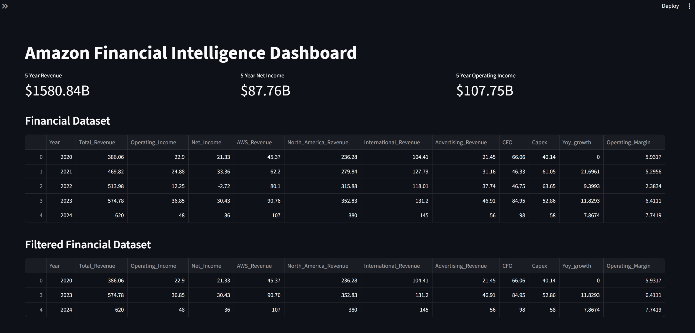

---

## KPI & Dataset Overview

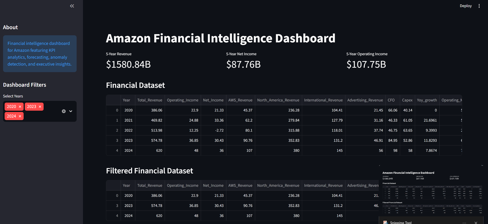

---

## Revenue Forecasting Dashboard

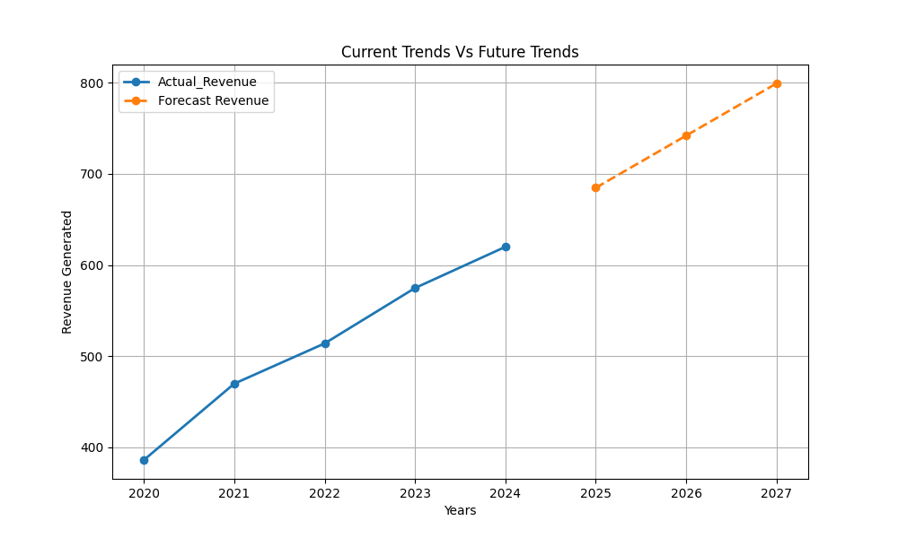

---

## Revenue Forecast Chart

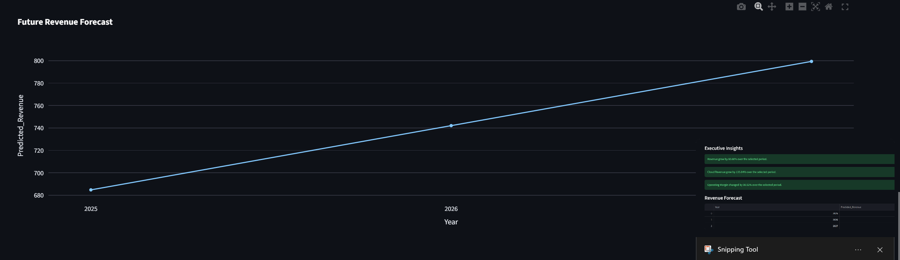

---

## Executive Insights

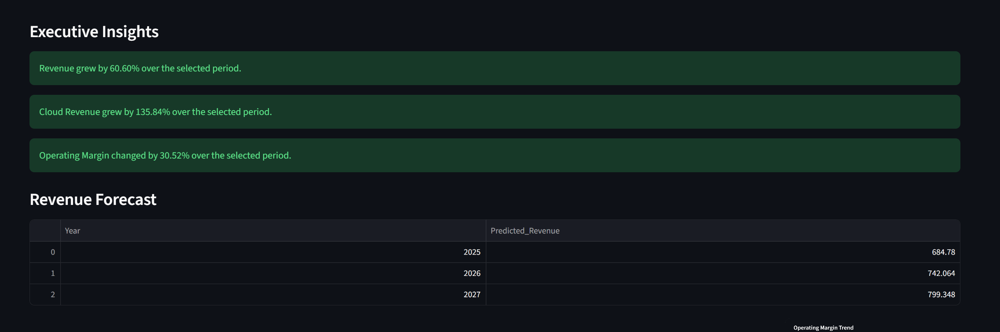

---

## AWS Contribution Analysis

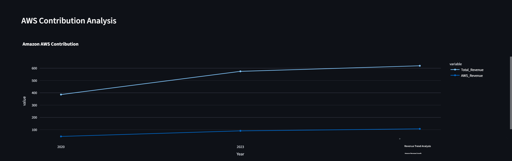

---

## AWS vs Revenue Trend

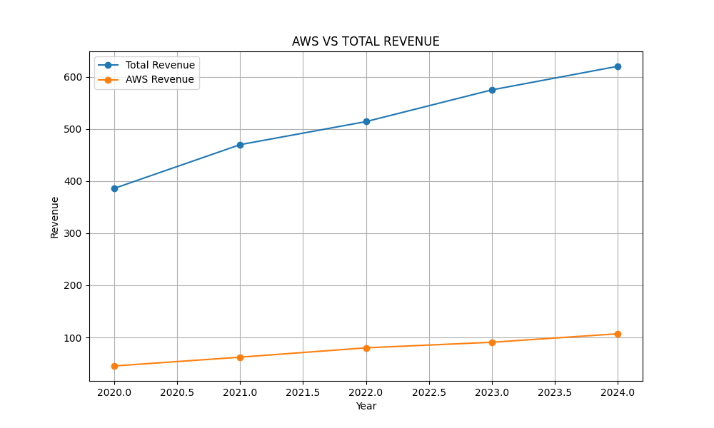

---

## Operating Margin Analysis

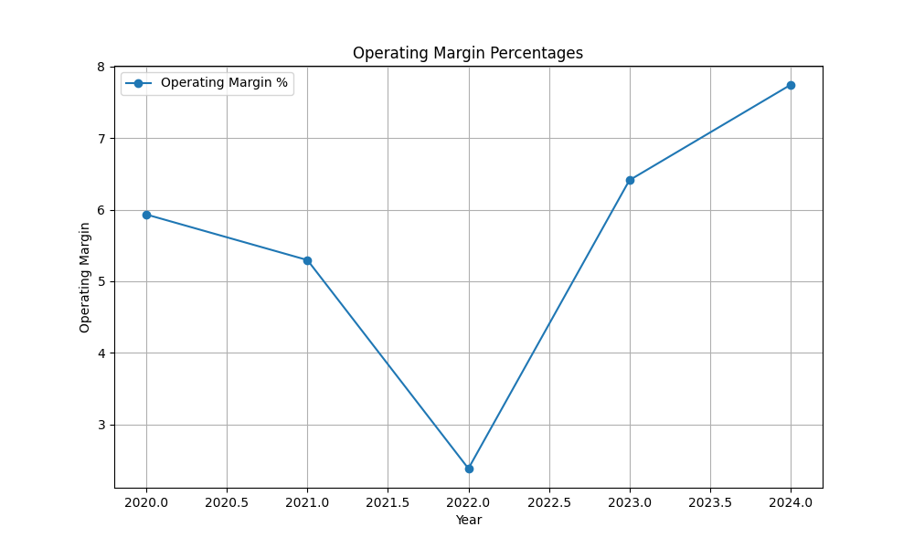

---

## Operating Margin Trend

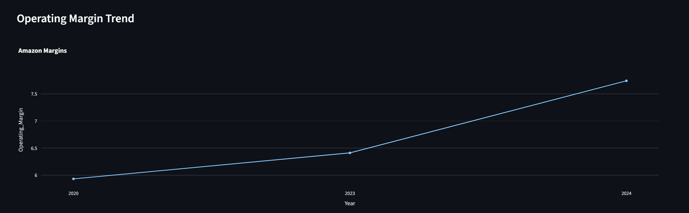

---

## Revenue Growth Analysis

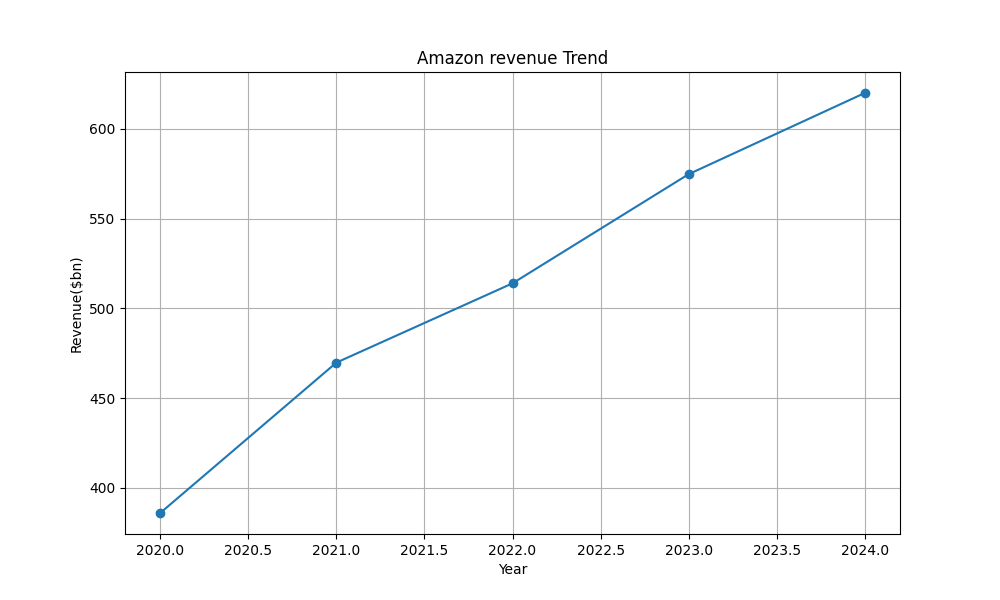

---

## YOY Growth Analysis

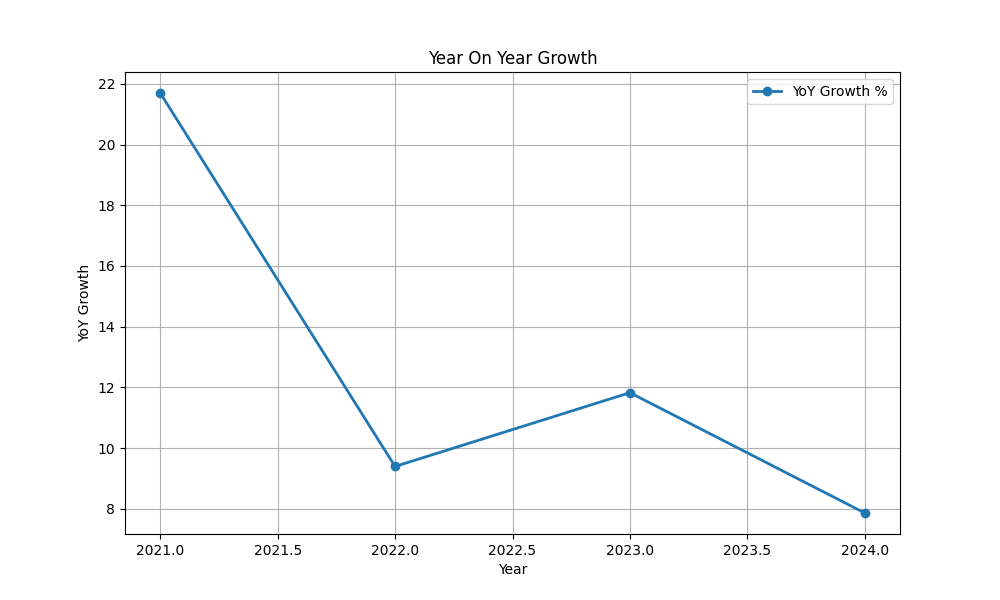

---

## Revenue Trend Visualization

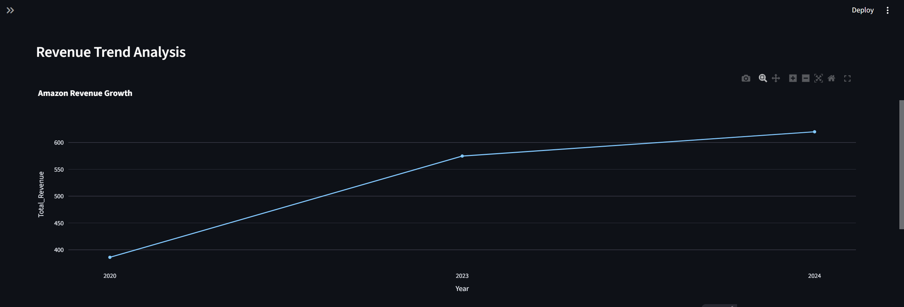

---

## Profitability Analysis

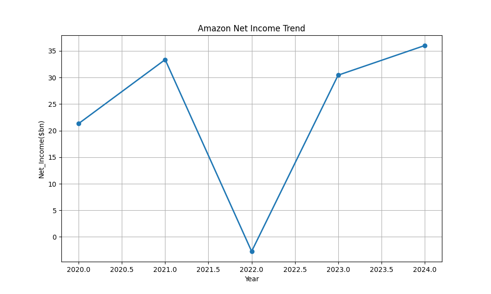

---

# Deployment

The application is deployment-ready using:

* Streamlit Community Cloud

Deployment architecture includes:

* Modular code structure
* Dependency management
* Reusable analytics pipelines
* Interactive dashboarding
* GitHub integration

---

# Future Enhancements

* Multi-company financial benchmarking
* Indian vs Global company analytics
* Advanced forecasting models
* Real-time API integration
* AI-generated business summaries
* Financial anomaly alert system
* Comparative industry analytics

---

# Author

Shivaum Shekhar Sharma

Computer Science Engineering (Data Science)
Manipal Institute of Technology, Bengaluru

---
